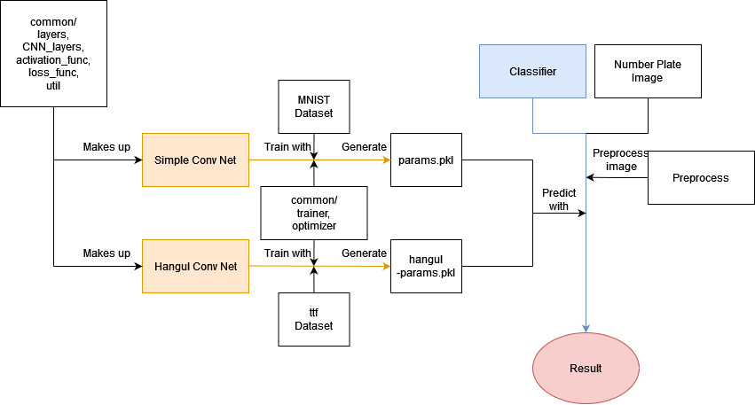

# IP-team-project2
Image Processing 2024 Fall 4-person team project 

# Authors
- **2j2h5**
    - [Github](https://github.com/2j2h5)
- **chaquentin**
    - [Github](https://github.com/chaquentin)
- **ThibaultMir**
    - [Github](https://github.com/ThibaultMir)
- **Chrysanthemum3552**
    - [Github](https://github.com/Chrysanthemum3552)

# Structure

This is the structure of the repository. The blue line represents the number prediction for a car license plate image using params.pkl and hangul-params.pkl after preprocessing the image. The params.pkl file is created by the train_conv_net code, which trains the simple_conv_net model using the MNIST dataset, as indicated by the orange line. The hangul-params.pkl is created by the train_hangul_conv_net code, which trains the hangul_conv_net model usint ttf dataset in dataset/hangul folder, as indicated by the orange line too. The simple_conv_net model and hangule_conv_net model are consist of layers defined in the CNN_layers and layers modules, which utilize activation and loss functions.

You can predict car license plate numbers by running main.py. This code first prepare Simple Conv Net and Hangul Conv Net. Then, prepare number plate images. And then finally, classifier predicts the cars number and vehicle type.

You can train the simple_conv_net model by running train_conv_net.py. And hangul_conv_net model by train_hangul_conv_net.py. The training is performed on the CPU, and it takes approximately one hour to complete. However, you don’t need to train the model yourself because a pre-trained params.pkl file and hangul-params.pkl are already included and used for predictions.
