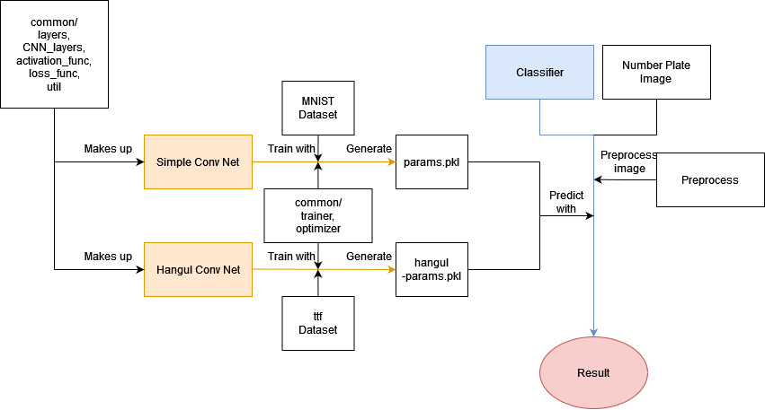
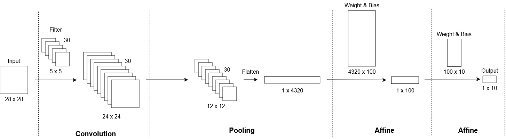

# IP-team-project2
Image Processing 2024 Fall 4-person team project 

# Authors
- **2j2h5**
    - [Github](https://github.com/2j2h5)
- **chaquentin**
    - [Github](https://github.com/chaquentin)
- **ThibaultMir**
    - [Github](https://github.com/ThibaultMir)
- **Chrysanthemum3552**
    - [Github](https://github.com/Chrysanthemum3552)

# Installation
 Install the required packages
```bash
pip install -r requirements.txt
```

# Structure


 This is the structure of the repository. The blue line represents the number prediction for a car license plate image using params.pkl and hangul-params.pkl after preprocessing the image. The params.pkl file is created by the train_conv_net code, which trains the simple_conv_net model using the MNIST dataset, as indicated by the orange line. The hangul-params.pkl is created by the train_hangul_conv_net code, which trains the Hangul Conv Net model usint ttf dataset in dataset/hangul folder, as indicated by the orange line too. The Simple Conv Net model and Hangul Conv Net model are consist of layers defined in the CNN_layers and layers modules, which utilize activation and loss functions.

 You can predict car license plate numbers by running main.py. This code first prepare Simple Conv Net and Hangul Conv Net. Then, prepare number plate images. And then finally, classifier predicts the cars number and vehicle type.

 You can train the Simple Conv net model by running train_conv_net.py. And Hangul Conv Net model by train_hangul_conv_net.py. The training is performed on the CPU, and it takes approximately one hour to complete. However, you don’t need to train the model yourself because a pre-trained params.pkl file and hangul-params.pkl are already included and used for predictions.


# CNN Models
 We use two CNN models named 'Simple Conv Net' and 'Hangul Conv Net'. They have one layer of convultion. First, follow diagram is Simple Conv Nets structure.

 The model operates in 4 main steps from input to output. The input is a 28×28 matrix representing the grayscale image of resolution 28×28. For this model, we use the MNIST dataset, which contains 70,000 images of handwritten digits along with their corresponding labels.

 The first step is the convolution layer. 30 filters of size 5×5 are applied to the input image. The result is 30 matrices of size 24×24, one for each filter. Next, a 2×2 max pooling operation is applied to reduce the size of the matrix by half. This results in 30 matrices of size 12×12. For two affine layers, the results of the pooling layer are flattened into a 1D vector with a shape of 1×4320 (12×12×30).

 Two affine (fully connected) layers are left. The first affine layer dot-products the 1×4320 input vector with a weight matrix of size 4320×100 and adds a bias. The result is a 1×100 vector. The second affine layer performs a similar operation with a weight matrix of size 100×10, producing a final 1×10 vector.

 The final result is a normalized 1×10 vector representing probabilities for each digit (0–9). The index of the maximum value corresponds to the model's prediction. For example, if the result is \[0.1, 0.05, 0.05, 0.05, 0.05, 0.1, 0.4, 0.05, 0.05, 0.1\], the model predicts the digit "6" because 0.4 is the highest value.

 If the prediction is incorrect, the model adjusts its filter values and weights based on the error. For instance, if the correct answer is "5" in the example above, the error for digit "5" would be 1−0.05=0.95. In this case, the model's prediction performance is poor, and it will modify its parameters to improve accuracy in future iterations.

 The affine layer is primarily responsible for producing probabilities to predict the class. The most significant layer, however, is the convolution layer because it processes spatial information. This spatial information refers to the values of surrounding pixels and how they interact. In contrast, the affine layer simply multiplies certain values with the pixels and does not process spatial relationships. This is why the model is called a Convolutional Neural Network (CNN).


 The Hangul Conv Net model operates using the same 4 main steps. The key difference is that the weight matrix of the last affine layer is 100×54, producing a 1×54 vector. In Korean, car license plates can include a Korean character, and there are 54 possible cases.

 For this model, we created the dataset using ttf font files. We extracted 28×28-sized images of Korean characters from 16 ttf files along with their corresponding labels. To expand the dataset, we applied data augmentation using elastic distortion to the 54 Korean character classes. As a result, we generated 3,180 images and labels, which are saved in the dataset/hangul/images folder.
