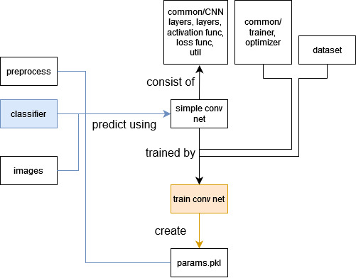

# IP-team-project2
Image Processing 2024 Fall 4-person team project 

# Authors
- **2j2h5**
    - [Github](https://github.com/2j2h5)

# Structure

This is the structure of the repository. The blue line represents the number prediction for a car license plate image using params.pkl after preprocessing the image. The params.pkl file is created by the train_conv_net code, which trains the simple_conv_net model using the MNIST dataset, as indicated by the orange line. The simple_conv_net model consists of layers defined in the CNN_layers and layers modules, which utilize activation and loss functions.

You can predict car license plate numbers by running classifier.py. This code first preprocesses the input by slicing the license plate image into individual characters. Then, it predicts each character, with the results printed to the console.

You can train the simple_conv_net model by running train_conv_net.py. The training is performed on the CPU, and it takes approximately one hour to complete. However, you don’t need to train the model yourself because a pre-trained params.pkl file is already included and used for predictions.